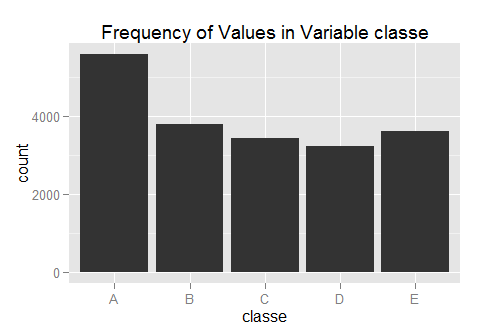
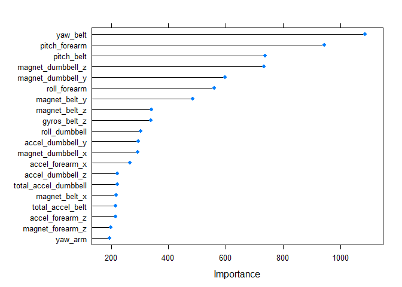

# Practical Machine Learning

## Introduction
This report analyzes a data set containing information from personal activity monitors such as *Jawbone Up*,
*Nike FuelBand* and *FitBit*.  These data sets contain measurements that quantify physical movement obtained
from accelerometers on the belt, forearm, arm and dumbbell of an individual.  We will analyze such a data set 
to construct a model that predicts the manner in which 6 individuals perform one set of 10 repetitions of the 
Unilateral Dumbbell Biceps Curl.  The manner in which an individual conducts this exercise is classified into 
5 types:  

* A = exactly according to the specification
* B = throwing the elbows to the front
* C = lifting the dumbbell only halfway
* D = lowering the dumbbell only halfway
* E = throwing the hips to the front 

For more information, visit http://groupware.les.inf.puc-rio.br/har .

To facilitate the analysis, we will need the following R packages:

```r
library(caret)
library(e1071)
library(randomForest)
```

## Data Sets
The data for this analysis is comprised of two sets, a training set and a testing set.  The former consists
of 19,622 records of 159 variables including the variable to be predicted, namely **classe**.  The latter 
consists of 20 records of 160 variables.  They are available as CSV files from the following links:

* Training set:  http://d396qusza40orc.cloudfront.net/predmachlearn/pml-training.csv
* Testing set:   http://d396qusza40orc.cloudfront.net/predmachlearn/pml-testing.csv

We read in the data with the following commands:

```r
raw_train <- read.table("pml-training.csv", sep=",", header=TRUE, stringsAsFactors=FALSE, na.strings=c('NA', '', '#DIV/0!'))
test      <- read.table("pml-testing.csv",  sep=",", header=TRUE, stringsAsFactors=FALSE, na.strings=c('NA', '', '#DIV/0!'))
```
As mentioned above, the variable we are trying to predict is **classe**.  It contains the values "A", "B",
"C", "D" and "E", corresponding to the way in which an individual conducts an exercise (see Introduction).
The following histogram illustrates the frequency of each value of the variable **classe** in the training set:

```r
qplot(classe, data = raw_train, geom = "histogram", main="Frequency of Values in Variable classe")
```

 

## Data (Pre)processing
A look at the test data set reveals that there are a number of potential predictor variables that contain
NA and/or have no value for many or all records.  Additionally, the first seven variables in this set are 
irrelevant to the prediction of the dependent variable **classe**.  Hence, we remove these variables from 
the training set.  The resulting data set has 19,622 records on 53 variables, each of which has a numeric 
value for all records:

```r
varsNA <- apply(apply(test, 2, is.na), 2, any)
firstSeven <- c("X", "user_name", "raw_timestamp_part_1", "raw_timestamp_part_2", "cvtd_timestamp", "new_window", "num_window")
badVarNames <- unique(c(firstSeven, colnames(test)[varsNA], "problem_id"))
train <- raw_train[, !(names(raw_train) %in% badVarNames)]
train$classe <- as.factor(train$classe)
dim(train)
```

```
## [1] 19622    53
```

```r
any(apply(apply(train, 2, is.na), 2, any))
```

```
## [1] FALSE
```
Before we apply any more data preprocessing, we will specify how we will be training and
testing candidate models.  We will split the **train** data set itself into a training
and testing set with a 70% / 30% split.  Hence, any further data preprocessing will be
done on the training portion of the **train** data set:

```r
set.seed(123456789)
trainIndex <- createDataPartition(y=train$classe, p = 0.7, list = FALSE)
train_train <- train[trainIndex, ]
train_test <- train[-trainIndex, ]
dim(train_train)
```

```
## [1] 13737    53
```

```r
dim(train_test)
```

```
## [1] 5885   53
```
### Zero Variance Predictors
We check to see if any of the variables in **train_train** are near zero variance predictors:

```r
vars_NZV <- nearZeroVar(train_train, saveMetrics = TRUE)
any(vars_NZV$nzv)
```

```
## [1] FALSE
```
The above result indicates that none of the 53 variables in the training set qualifies as a near zero 
variance predictor.

### Highly Correlated Predictors
We next check for variables that are highly correlated, as this can cause problems for some types of
predictive models.  We impose a threshold of 90% correlation.  The following code reveals that there 
are 5 variables that are highly correlated.  After removing them from the data set, the maximum 
correlation between the variables (in absolute value) is about 88%:

```r
highCorrVars <- findCorrelation(cor(subset(train_train, select=-c(classe))), cutoff = 0.90)
colnames(train_train)[highCorrVars]
```

```
## [1] "accel_belt_z" "roll_belt"    "accel_belt_y" "accel_belt_x"
## [5] "gyros_arm_y"
```

```r
train_train <- train_train[, -highCorrVars]
corrMat <- cor(subset(train_train, select=-c(classe)))
summary(corrMat[upper.tri(corrMat)])
```

```
##    Min. 1st Qu.  Median    Mean 3rd Qu.    Max. 
## -0.8810 -0.1120  0.0028  0.0027  0.1010  0.8500
```

```r
dim(train_train)
```

```
## [1] 13737    48
```
Hence, our final training set consists of 13,737 records on 47 predictor variables plus the dependent
variable **classe** (48 variables in total).

## Predictive Model -- Random Forest
We choose a random forest as our predictive model.  We do so for a number of reasons.  First, the
outcome variable is discrete and hence our problem is one of classification; random forests
generally do a much better job of modeling such problems than say decision trees, albeit at the
expense of interpretability.  Additionally, random forests can handle possibly nonlinear 
relationships between the outcome variable and the predictors.

The model will be trained on the **train_train** data set using 10-fold cross-validation.  To get 
an estimate of the out-of-sample accuracy, the model will be tested on the **train_test** data set.

```r
set.seed(987654321)
modFit <- train(classe ~ ., method="rf", trControl=trainControl(method="cv", number=10), data=train_train, allowParallel=TRUE)
print(modFit, digits=4)
```

```
## Random Forest 
## 
## 13737 samples
##    47 predictor
##     5 classes: 'A', 'B', 'C', 'D', 'E' 
## 
## No pre-processing
## Resampling: Cross-Validated (10 fold) 
## 
## Summary of sample sizes: 12363, 12362, 12364, 12363, 12362, 12365, ... 
## 
## Resampling results across tuning parameters:
## 
##   mtry  Accuracy  Kappa   Accuracy SD  Kappa SD
##    2    0.9917    0.9895  0.003851     0.004873
##   24    0.9926    0.9906  0.002628     0.003325
##   47    0.9832    0.9787  0.003278     0.004149
## 
## Accuracy was used to select the optimal model using  the largest value.
## The final value used for the model was mtry = 24.
```

```r
modFit$finalModel
```

```
## 
## Call:
##  randomForest(x = x, y = y, mtry = param$mtry, allowParallel = TRUE) 
##                Type of random forest: classification
##                      Number of trees: 500
## No. of variables tried at each split: 24
## 
##         OOB estimate of  error rate: 0.69%
## Confusion matrix:
##      A    B    C    D    E class.error
## A 3898    6    1    0    1    0.002048
## B   22 2625   11    0    0    0.012415
## C    0    9 2379    8    0    0.007095
## D    0    0   24 2225    3    0.011989
## E    0    0    3    7 2515    0.003960
```
The above output indicates a number of things.  First, the final model considers 24 out of the
original 47 predictor variables at each split.  For this choice, the model accuracy over the
cross-validation set is 99.26% with an out-of-bag error rate of 0.69%.  In general, it
seems that the model has the most difficulty correctly identifying movement C, i.e. "lifting
the dumbell only halfway".

As a matter of interest, we can look at the top 20 most important variables in the trained model:

```r
plot(varImp(modFit, scale = FALSE), top = 20)
```

 

We can now apply this trained model to the testing portion of the original training data, namely
the data set **train_test** to get an idea for the out-of-sample accuracy:

```r
predict_test <- predict(modFit, newdata = train_test)
confusionMatrix(train_test$classe, predict_test)
```

```
## Confusion Matrix and Statistics
## 
##           Reference
## Prediction    A    B    C    D    E
##          A 1673    0    0    0    1
##          B    4 1129    6    0    0
##          C    0    4 1020    2    0
##          D    0    0   11  953    0
##          E    0    0    2    1 1079
## 
## Overall Statistics
##                                         
##                Accuracy : 0.995         
##                  95% CI : (0.993, 0.996)
##     No Information Rate : 0.285         
##     P-Value [Acc > NIR] : <2e-16        
##                                         
##                   Kappa : 0.993         
##  Mcnemar's Test P-Value : NA            
## 
## Statistics by Class:
## 
##                      Class: A Class: B Class: C Class: D Class: E
## Sensitivity             0.998    0.996    0.982    0.997    0.999
## Specificity             1.000    0.998    0.999    0.998    0.999
## Pos Pred Value          0.999    0.991    0.994    0.989    0.997
## Neg Pred Value          0.999    0.999    0.996    0.999    1.000
## Prevalence              0.285    0.193    0.177    0.162    0.184
## Detection Rate          0.284    0.192    0.173    0.162    0.183
## Detection Prevalence    0.284    0.194    0.174    0.164    0.184
## Balanced Accuracy       0.999    0.997    0.990    0.997    0.999
```
The out-of-sample accuracy of the model is approximately 99.47% with a concordance (Kappa) of 99.33%.
This accuracy is quite close to the accuracy estimate produced in the cross-validation results.
From that table, we saw that a model with 24 predictors used at each split had an accuracy of 99.26%
which is within the 95% confidence interval of the out-of-sample estimate.  Here again, the 
confusion matrix indicates that the model has the most difficulty predicting the act of
"C = lifting the dumbell only halfway".

### Prediction Results For Test Set
Finally, we can apply the trained model to the original testing set to get predictions for the
20 cases of interest.  

```r
predictions <- predict(modFit, newdata = test)
print(predictions)
```

```
##  [1] B A B A A E D B A A B C B A E E A B B B
## Levels: A B C D E
```

### Write Results To File

```r
pml_write_files = function(x){
  n = length(x)
  for(i in 1:n){
    filename = paste0("problem_id_",i,".txt")
    write.table(x[i],file=filename,quote=FALSE,row.names=FALSE,col.names=FALSE)
  }
}
pml_write_files(predictions)
```

